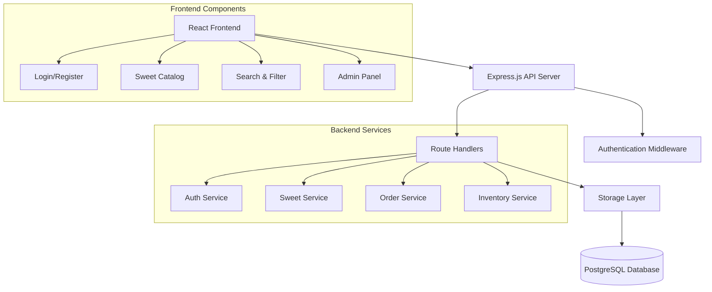

# Sweet Shop Management System - Design Document

## Overview

The Sweet Shop Management System is a full-stack web application built with TypeScript, React, Express.js, and PostgreSQL. The system leverages the existing project structure and database schema, which already includes comprehensive models for users, sweets, orders, and inventory management. The application follows a modern three-tier architecture with clear separation between presentation, business logic, and data layers.

## Architecture

### High-Level Architecture



### Technology Stack

- **Frontend**: React 18 with TypeScript, Tailwind CSS, Radix UI components
- **Backend**: Express.js with TypeScript, Passport.js for authentication
- **Database**: PostgreSQL with Drizzle ORM
- **State Management**: TanStack Query for server state
- **Routing**: Wouter for client-side routing
- **Build Tool**: Vite for development and production builds

## Components and Interfaces

### Frontend Components

#### Core Layout Components
- **App.tsx**: Main application component with routing and authentication context
- **Layout**: Common layout wrapper with navigation and user context
- **Navigation**: Responsive navigation bar with user authentication status

#### Authentication Components
- **LoginForm**: User login with username/password validation
- **RegisterForm**: User registration with form validation
- **AuthGuard**: Protected route wrapper for authenticated users
- **AdminGuard**: Protected route wrapper for admin users

#### Sweet Management Components
- **SweetCatalog**: Grid display of all available sweets with filtering
- **SweetCard**: Individual sweet display with purchase functionality
- **SweetSearch**: Search and filter interface with category and price filters
- **SweetForm**: Admin form for creating/editing sweets
- **PurchaseButton**: Smart button that handles purchase logic and state

#### Admin Components
- **AdminDashboard**: Overview of inventory and recent activity
- **SweetManagement**: CRUD interface for sweet management
- **InventoryPanel**: Restock and inventory adjustment interface
- **UserManagement**: User role management (if needed)

### Backend API Endpoints

#### Authentication Routes (`/api/auth`)
```typescript
POST /api/auth/register
POST /api/auth/login
POST /api/auth/logout
GET /api/auth/me
```

#### Sweet Routes (`/api/sweets`)
```typescript
GET /api/sweets              // Get all sweets with optional filters
GET /api/sweets/search       // Search sweets by name, category, price
GET /api/sweets/:id          // Get specific sweet
POST /api/sweets             // Create new sweet (admin only)
PUT /api/sweets/:id          // Update sweet (admin only)
DELETE /api/sweets/:id       // Delete sweet (admin only)
POST /api/sweets/:id/purchase // Purchase sweet (authenticated)
POST /api/sweets/:id/restock  // Restock sweet (admin only)
```

#### Order Routes (`/api/orders`)
```typescript
GET /api/orders              // Get user's orders
POST /api/orders             // Create new order
GET /api/orders/:id          // Get specific order
```

### Storage Layer Interface

The storage layer provides a clean abstraction over database operations:

```typescript
interface StorageInterface {
  // User operations
  insertUser(user: InsertUser): Promise<User>
  getUserByUsername(username: string): Promise<User | null>
  getUserById(id: string): Promise<User | null>
  
  // Sweet operations
  getAllSweets(filters?: SweetFilters): Promise<Sweet[]>
  getSweetById(id: string): Promise<Sweet | null>
  insertSweet(sweet: InsertSweet): Promise<Sweet>
  updateSweet(id: string, updates: Partial<Sweet>): Promise<Sweet>
  deleteSweet(id: string): Promise<void>
  searchSweets(query: string, filters?: SweetFilters): Promise<Sweet[]>
  
  // Inventory operations
  purchaseSweet(sweetId: string, quantity: number): Promise<void>
  restockSweet(sweetId: string, quantity: number): Promise<void>
  recordInventoryAdjustment(adjustment: InsertInventoryAdjustment): Promise<void>
  
  // Order operations
  createOrder(order: InsertOrder, items: InsertOrderItem[]): Promise<Order>
  getUserOrders(userId: string): Promise<Order[]>
}
```

## Data Models

The existing database schema is well-designed for the Sweet Shop system:

### Users Table
- Supports role-based access control with `role` field
- Secure password storage (will be hashed)
- Unique username constraint

### Sweets Table
- Complete product information including pricing and inventory
- Category-based organization
- Soft delete capability with `active` field
- Automatic reorder point tracking
- Audit trail with created/updated timestamps

### Orders & Order Items Tables
- Complete order tracking system
- Support for both registered and guest orders
- Detailed line item tracking with historical pricing

### Inventory Adjustments Table
- Complete audit trail for all inventory changes
- Supports multiple adjustment reasons (sale, restock, loss, correction)
- Essential for inventory reconciliation and reporting

## Error Handling

### Frontend Error Handling
- **Network Errors**: Toast notifications for API failures
- **Validation Errors**: Inline form validation with error messages
- **Authentication Errors**: Redirect to login with error message
- **Authorization Errors**: Access denied page with appropriate messaging

### Backend Error Handling
- **Validation Errors**: 400 Bad Request with detailed field errors
- **Authentication Errors**: 401 Unauthorized with clear messaging
- **Authorization Errors**: 403 Forbidden for insufficient permissions
- **Not Found Errors**: 404 Not Found for missing resources
- **Server Errors**: 500 Internal Server Error with logged details

### Database Error Handling
- **Connection Errors**: Graceful degradation with retry logic
- **Constraint Violations**: Meaningful error messages for users
- **Transaction Failures**: Proper rollback and error reporting
- **Concurrency Issues**: Optimistic locking for inventory updates

## Testing Strategy

### Unit Testing
- **Backend Services**: Test all business logic functions in isolation
- **Database Operations**: Test storage layer with test database
- **Utility Functions**: Test validation, formatting, and helper functions
- **Authentication Logic**: Test JWT generation, validation, and middleware

### Integration Testing
- **API Endpoints**: Test complete request/response cycles
- **Database Integration**: Test ORM queries and transactions
- **Authentication Flow**: Test login, registration, and protected routes
- **Purchase Flow**: Test inventory updates and order creation

### Component Testing
- **React Components**: Test rendering, user interactions, and state changes
- **Form Validation**: Test input validation and error display
- **Authentication Components**: Test login/logout flows
- **Admin Components**: Test CRUD operations and permissions

### End-to-End Testing
- **User Registration/Login**: Complete authentication flow
- **Sweet Browsing**: Catalog viewing, searching, and filtering
- **Purchase Flow**: Complete purchase process with inventory updates
- **Admin Operations**: Sweet management and inventory operations

## Security Considerations

### Authentication & Authorization
- **JWT Tokens**: Secure token generation with appropriate expiration
- **Password Hashing**: bcrypt for secure password storage
- **Role-Based Access**: Middleware to enforce admin-only operations
- **Session Management**: Secure session handling with proper cleanup

### Data Protection
- **Input Validation**: Comprehensive validation using Zod schemas
- **SQL Injection Prevention**: Parameterized queries via Drizzle ORM
- **XSS Prevention**: Proper output encoding and CSP headers
- **CSRF Protection**: CSRF tokens for state-changing operations

### API Security
- **Rate Limiting**: Prevent abuse of API endpoints
- **CORS Configuration**: Proper cross-origin request handling
- **HTTPS Enforcement**: Secure communication in production
- **Error Information**: Avoid exposing sensitive system details

## Performance Optimizations

### Frontend Performance
- **Code Splitting**: Lazy loading for admin components
- **Image Optimization**: Optimized sweet images with proper sizing
- **Caching**: TanStack Query for intelligent data caching
- **Bundle Optimization**: Tree shaking and minification

### Backend Performance
- **Database Indexing**: Proper indexes on frequently queried fields
- **Connection Pooling**: Efficient database connection management
- **Query Optimization**: Efficient queries with proper joins
- **Caching Strategy**: Redis caching for frequently accessed data

### Database Performance
- **Indexes**: Strategic indexes on search and filter fields
- **Query Optimization**: Efficient queries for catalog and search
- **Connection Management**: Proper connection pooling
- **Transaction Optimization**: Minimal transaction scope for inventory updates